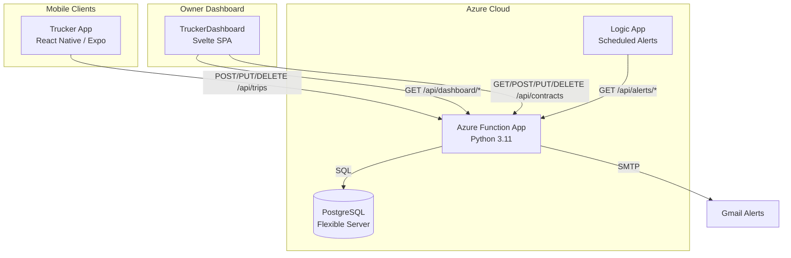
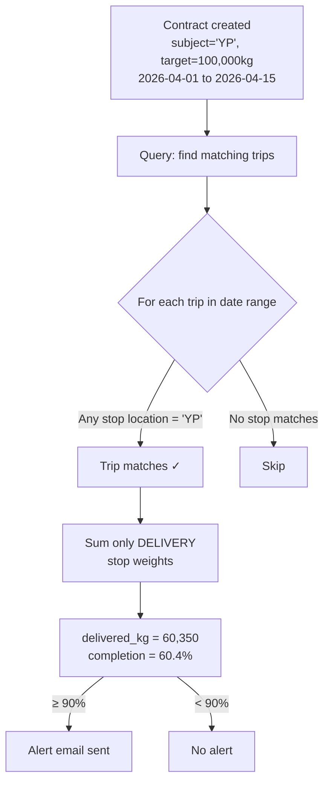
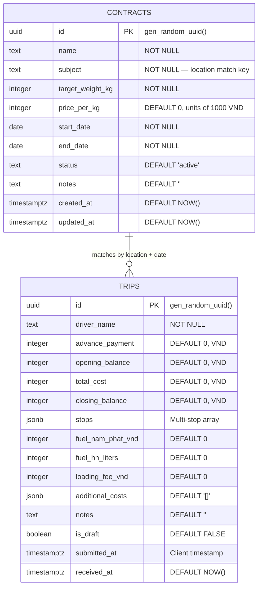
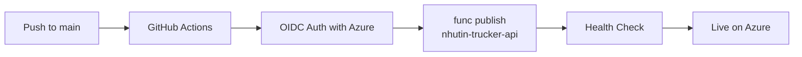

# NhuTin Trucker API

REST API backend for the NhuTin Trucker mobile app — a logistics management system for a Vietnamese trucking SME. Built as a serverless Azure Function App backed by PostgreSQL.

## System Overview



## Trip Lifecycle

Each trip represents a single pickup-to-delivery journey (e.g., TPG → TBS). A driver can complete multiple trips per day. Trips follow this state machine:


**Key design decisions:**
- **In-place updates** (PUT) instead of append-only rows — eliminates duplicate data from repeated submissions
- **30-day edit window** — drivers can correct mistakes (wrong fuel price, missing costs) without owner intervention, but data stabilizes for accounting after 30 days
- **No authentication** — deliberate choice for SME context; truckers share devices, and friction kills adoption. Security is handled at the network/Azure level.

## Contract Matching

Shipment contracts define a target tonnage, price/kg, and date range. Trips are auto-matched to contracts at query time — no manual linking required.



**Matching logic (PostgreSQL lateral join):**
1. Find trips where **any** stop (pickup OR delivery) has a `location` matching the contract `subject` (case-insensitive, trimmed)
2. Trip `submitted_at` must fall within `start_date` to `end_date` (inclusive)
3. Only completed trips counted (`is_draft = FALSE`)
4. Sum only **delivery** stop weights — pickup weight ≠ delivered goods
5. `DISTINCT ON trip.id` prevents double-counting if both pickup and delivery match

## API Reference

| Method | Route | Description | Status Codes |
|--------|-------|-------------|--------------|
| `POST` | `/api/trips` | Create a new trip | `201`, `400`, `500` |
| `PUT` | `/api/trips/{trip_id}` | Update existing trip (within 30-day window) | `200`, `400`, `403`, `404`, `500` |
| `DELETE` | `/api/trips/{trip_id}` | Delete a trip | `200`, `404`, `500` |
| `GET` | `/api/trips` | List trips with filters | `200`, `500` |
| `GET` | `/api/dashboard/summary` | Aggregate stats (total trips, revenue, costs) | `200`, `500` |
| `GET` | `/api/dashboard/trips` | Trip data for dashboard tables/charts | `200`, `500` |
| `GET` | `/api/dashboard/drivers` | Distinct driver names | `200`, `500` |
| `GET` | `/api/dashboard/locations` | Distinct pickup/delivery locations exploded from `stops` JSONB | `200`, `500` |
| `POST` | `/api/contracts` | Create a shipment contract | `201`, `400`, `500` |
| `GET` | `/api/contracts` | List contracts with auto-computed delivery progress | `200`, `500` |
| `PUT` | `/api/contracts/{id}` | Update a contract | `200`, `400`, `404`, `500` |
| `DELETE` | `/api/contracts/{id}` | Delete a contract | `200`, `404`, `500` |
| `GET` | `/api/alerts/check-balances` | Check low-balance drivers + send email | `200`, `500` |
| `GET` | `/api/alerts/check-contracts` | Check contracts ≥90% completion + send email | `200`, `500` |
| `GET` | `/api/health` | Health check | `200` |
| `OPTIONS` | `/*` | CORS preflight | `204` |

### POST /api/contracts

Create a new shipment contract.

```json
{
  "name": "HĐ tháng 4 TBS",
  "subject": "YP",
  "targetWeightKg": 100000,
  "pricePerKg": 200,
  "startDate": "2026-04-01",
  "endDate": "2026-04-15",
  "notes": ""
}
```

**Response** (`201`):
```json
{ "status": "ok", "contractId": "uuid-here" }
```

### GET /api/contracts

Returns all contracts with auto-computed delivery progress.

| Query Param | Type | Default | Description |
|-------------|------|---------|-------------|
| `status` | string | — | Filter by status (`active`, `completed`, `cancelled`) |

**Response:**
```json
{
  "contracts": [
    {
      "id": "uuid",
      "name": "HĐ tháng 4 TBS",
      "subject": "YP",
      "targetWeightKg": 100000,
      "deliveredWeightKg": 60350,
      "pricePerKg": 200,
      "startDate": "2026-04-01",
      "endDate": "2026-04-15",
      "status": "active",
      "completionPct": 60.4,
      "remainingKg": 39650,
      "contractValueVnd": 20000000000,
      "daysLeft": 9,
      "alerting": false,
      "notes": ""
    }
  ],
  "count": 1
}
```

### POST /api/trips

Create a new trip record.

```json
{
  "driverName": "NPHau",
  "advancePayment": 2000000,
  "stops": [
    { "seq": 1, "type": "pickup", "location": "YP", "date": "2026-04-01T08:00:00Z", "weightKg": 15000, "gps": null },
    { "seq": 2, "type": "delivery", "location": "LHH", "date": "2026-04-01T14:00:00Z", "weightKg": 14990, "gps": null }
  ],
  "fuelNamPhatVnd": 500000,
  "fuelHnLiters": 200,
  "loadingFeeVnd": 300000,
  "additionalCosts": [
    { "name": "Xe xúc", "amountVnd": 50000, "note": "" }
  ],
  "openingBalance": 5000000,
  "totalCost": 850000,
  "closingBalance": 6150000,
  "notes": "",
  "isDraft": false,
  "submittedAt": "2026-04-01T14:00:00Z"
}
```

**Response** (`201`):
```json
{ "status": "ok", "tripId": "uuid-here", "isDraft": false }
```

## Database Schema



**Balance formula (computed client-side):** `closing_balance = opening_balance + advance_payment - (total_cost - fuel_nam_phat_vnd)`

**Location codes** (configured in mobile app):
- **Pickup:** TPG, HL, KG, DQ, TLLT, TLTB, YP, X
- **Delivery:** TBS, LHH, HT, NQ, TPH, DTT, BSLA, X, VTL, TDL

## Project Structure

```
TruckerMobileBackend/
├── function_app.py        # Entry point — registers all route modules
├── config.py              # Config from env vars (PG, alerts, Gmail)
├── functions/             # Azure Function endpoints (one file per domain)
│   ├── trips.py           # Trip CRUD: POST, PUT, DELETE, GET /api/trips
│   ├── contracts.py       # Contract CRUD: POST, GET, PUT, DELETE /api/contracts
│   ├── dashboard.py       # GET /api/dashboard/summary, /trips, /drivers
│   ├── alerts.py          # GET /api/alerts/check-balances, /check-contracts
│   └── health.py          # GET /api/health + OPTIONS CORS preflight
├── services/              # Shared business logic and helpers
│   ├── database.py        # Database class (psycopg2, schema init)
│   ├── response.py        # ResponseHelper with CORS headers
│   └── email.py           # Gmail SMTP sender
├── docs/
│   └── RULES.md           # AI governance rules
├── requirements.txt
├── host.json
├── Dockerfile
└── local.settings.json    # Local dev settings (gitignored)
```

## Local Development

### Prerequisites
- Python 3.11+
- [Azure Functions Core Tools](https://learn.microsoft.com/en-us/azure/azure-functions/functions-run-local) v4
- PostgreSQL (local or remote)

### Setup

1. Configure database credentials in `local.settings.json`:
```json
{
  "Values": {
    "PG_HOST": "localhost",
    "PG_PORT": "5432",
    "PG_DATABASE": "trucker",
    "PG_USER": "postgres",
    "PG_PASSWORD": "your-password",
    "PG_SSLMODE": "prefer"
  }
}
```

2. Install and run:
```bash
pip install -r requirements.txt
func start
```

Both `trips` and `contracts` tables are auto-created on cold start via `init_db()`.

## Deployment

Deployed via GitHub Actions on push to `main` branch:



**Production:**
- Function App: `nhutin-trucker-api.azurewebsites.net`
- Database: Azure Database for PostgreSQL Flexible Server (Burstable tier, ~$13/month)
- Runtime: Python 3.11, Flex Consumption plan

### Configuration

| Variable | Description | Default |
|----------|-------------|---------|
| `PG_HOST` | PostgreSQL host | — |
| `PG_PORT` | PostgreSQL port | `5432` |
| `PG_DATABASE` | Database name | `nhutin` |
| `PG_USER` | Database user | — |
| `PG_PASSWORD` | Database password | — |
| `LOW_BALANCE_THRESHOLD` | Balance alert threshold (VND) | `500000` |
| `CONTRACT_ALERT_THRESHOLD` | Contract completion alert (%) | `90` |
| `GMAIL_ADDRESS` | Sender email for alerts | — |
| `GMAIL_APP_PASSWORD` | Google app password | — |
| `ALERT_RECIPIENTS` | Comma-separated recipient emails | — |

## Architecture Decisions

| Decision | Rationale |
|----------|-----------|
| Modular `functions/` + `services/` | Each module stays under 300 lines with OOP and docstrings (per RULES.md) |
| No ORM | Direct psycopg2 via `Database` helper — fewer dependencies, full SQL control |
| PostgreSQL over Cosmos DB | Relational queries needed; Burstable PG is 10x cheaper for this workload |
| No auth layer | SME with 3 trusted drivers; API is behind Azure networking |
| Contract matching at query time | No FK links — lateral join computes fulfillment on read. No sync issues when trips are edited/deleted |
| JSONB for stops + additional_costs | Flexible schema for variable-length arrays without join tables |

## Related Repos

- **[TruckerMobile](https://github.com/maiduydung/TruckerMobile)** — React Native/Expo mobile app for truck drivers
- **[TruckerDashboard](https://github.com/maiduydung/TruckerDashboard)** — Svelte SPA for the business owner to view trips, contracts, and export reports
