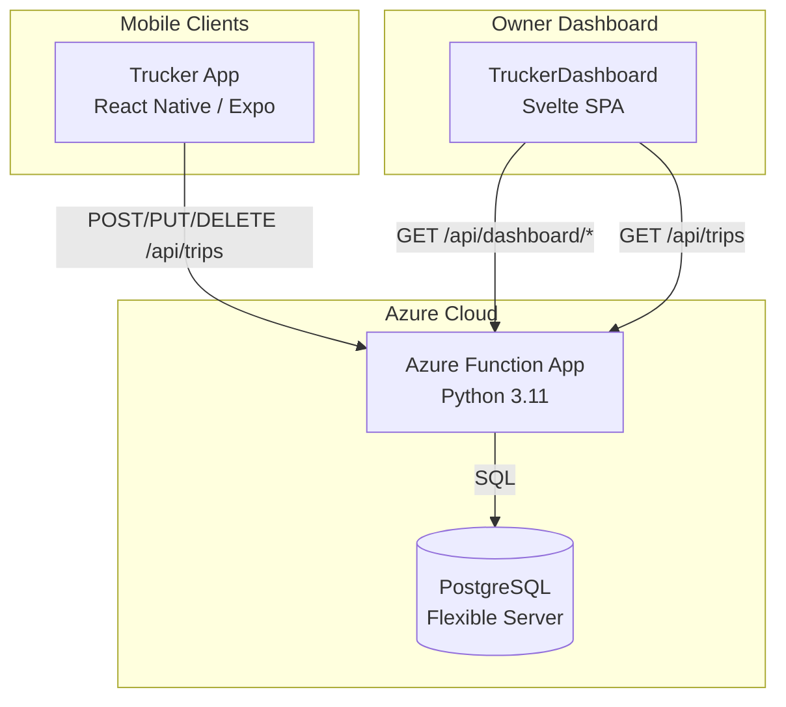
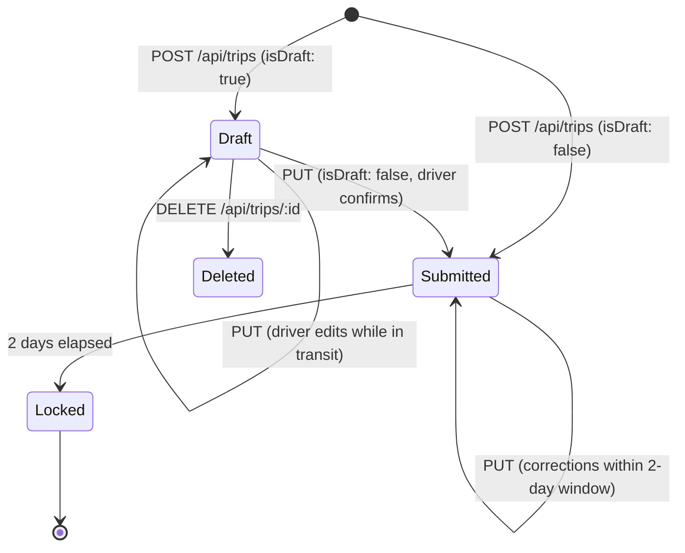
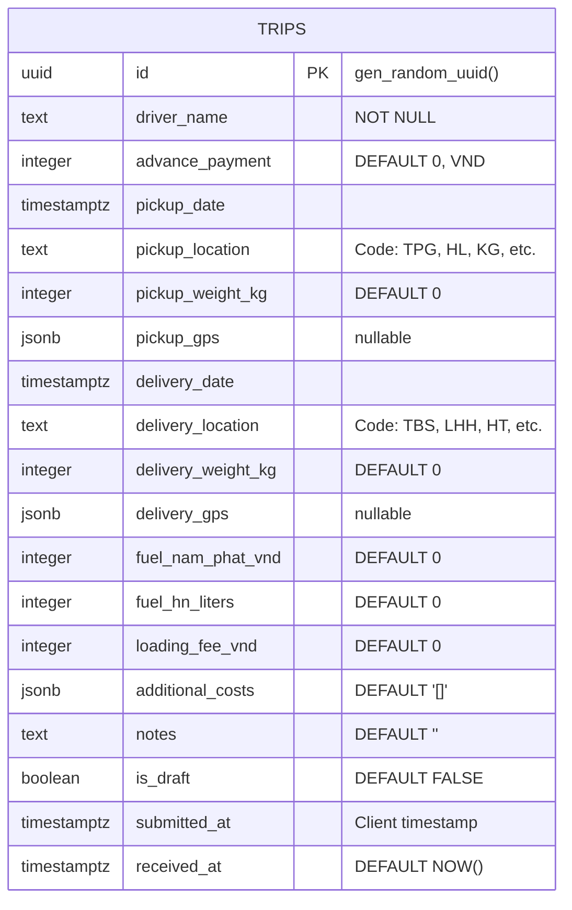
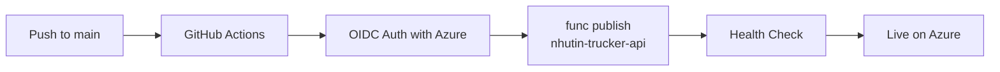

# NhuTin Trucker API

REST API backend for the NhuTin Trucker mobile app — a logistics management system for a Vietnamese trucking SME. Built as a serverless Azure Function App backed by PostgreSQL.

## System Overview



## Trip Lifecycle

Each trip represents a single pickup-to-delivery journey (e.g., TPG → TBS). A driver can complete multiple trips per day. Trips follow this state machine:



**Key design decisions:**
- **In-place updates** (PUT) instead of append-only rows — eliminates duplicate data from repeated submissions
- **2-day edit window** — drivers can correct mistakes (wrong fuel price, missing costs) without owner intervention, but data stabilizes for accounting after 48 hours
- **No authentication** — deliberate choice for SME context; truckers share devices, and friction kills adoption. Security is handled at the network/Azure level.

## API Reference

| Method | Route | Description | Status Codes |
|--------|-------|-------------|--------------|
| `POST` | `/api/trips` | Create a new trip | `201`, `400`, `500` |
| `PUT` | `/api/trips/{trip_id}` | Update existing trip (within 2-day window) | `200`, `400`, `403`, `404`, `500` |
| `DELETE` | `/api/trips/{trip_id}` | Delete a trip | `200`, `404`, `500` |
| `GET` | `/api/trips` | List trips with filters | `200`, `500` |
| `GET` | `/api/dashboard/summary` | Aggregate stats (total trips, revenue, costs) | `200`, `500` |
| `GET` | `/api/dashboard/trips` | Trip data for dashboard tables/charts | `200`, `500` |
| `GET` | `/api/dashboard/drivers` | Per-driver stats and activity | `200`, `500` |
| `GET` | `/api/health` | Health check | `200` |
| `OPTIONS` | `/*` | CORS preflight | `204` |

### POST /api/trips

Create a new trip record.

```json
{
  "driverName": "NPHau",
  "advancePayment": 2000000,
  "pickupDate": "2026-03-26T00:00:00.000Z",
  "pickupLocation": "TPG",
  "pickupWeightKg": 5000,
  "pickupGps": null,
  "deliveryDate": "2026-03-26T00:00:00.000Z",
  "deliveryLocation": "TBS",
  "deliveryWeightKg": 4800,
  "deliveryGps": null,
  "fuelNamPhatVnd": 500000,
  "fuelHnLiters": 200,
  "loadingFeeVnd": 300000,
  "additionalCosts": [
    { "name": "Cầu đường", "amountVnd": 100000, "note": "Quốc lộ 1A" }
  ],
  "notes": "",
  "isDraft": true,
  "submittedAt": "2026-03-26T12:00:00.000Z"
}
```

**Response** (`201`):
```json
{ "status": "ok", "tripId": "uuid-here", "isDraft": true }
```

### PUT /api/trips/{trip_id}

Update an existing trip. Same body as POST. Returns `403` if trip is older than 2 days.

### GET /api/trips

| Query Param | Type | Default | Description |
|-------------|------|---------|-------------|
| `driver` | string | — | Filter by driver name (exact match) |
| `includeDrafts` | boolean | `false` | Include draft trips in results |
| `sinceDays` | integer | — | Only return trips from the last N days |

**Example:** `GET /api/trips?driver=NPHau&includeDrafts=true&sinceDays=2`

## Database Schema

Single table design — optimized for simplicity over normalization. This is intentional for an SME with 3 drivers and < 100 trips/month.



**Location codes** (configured in mobile app):
- **Pickup:** TPG, HL, KG, DQ, TLLT, TLTB, YP, X
- **Delivery:** TBS, LHH, HT, NQ, TPH, DTT, BSLA, X, VTL, TDL

## Project Structure

```
TruckerMobileBackend/
├── function_app.py        # Entry point — registers blueprints from functions/
├── config.py              # PostgreSQL connection config from env vars
├── functions/             # Azure Function endpoints (one file per domain)
│   ├── __init__.py
│   ├── trips.py           # Trip CRUD: POST, PUT, DELETE, GET /api/trips
│   ├── health.py          # GET /api/health + OPTIONS CORS preflight
│   └── dashboard.py       # GET /api/dashboard/summary, /trips, /drivers
├── services/              # Shared business logic and helpers
│   ├── __init__.py
│   ├── database.py        # Database class with query helpers (psycopg2)
│   └── response.py        # ResponseHelper class with CORS headers
├── requirements.txt       # Python dependencies (3 packages)
├── host.json              # Azure Functions runtime config
├── Dockerfile             # Container deployment option
├── local.settings.json    # Local dev settings (gitignored)
└── .github/
    └── workflows/
        └── deploy.yml     # CI/CD: GitHub Actions → Azure Function App
```

## Local Development

### Prerequisites
- Python 3.11+
- [Azure Functions Core Tools](https://learn.microsoft.com/en-us/azure/azure-functions/functions-run-local) v4
- PostgreSQL (local or remote)

### Setup

1. Configure database credentials in `local.settings.json`:
```json
{
  "Values": {
    "PG_HOST": "localhost",
    "PG_PORT": "5432",
    "PG_DATABASE": "trucker",
    "PG_USER": "postgres",
    "PG_PASSWORD": "your-password",
    "PG_SSLMODE": "prefer"
  }
}
```

2. Install and run:
```bash
pip install -r requirements.txt
func start
```

The `trips` table is auto-created on cold start via `init_db()`.

## Deployment

Deployed via GitHub Actions on push to `main` branch:



**Production:**
- Function App: `nhutin-trucker-api.azurewebsites.net`
- Database: Azure Database for PostgreSQL Flexible Server (Burstable tier, ~$13/month)
- Runtime: Python 3.11, Flex Consumption plan

## Architecture Decisions

| Decision | Rationale |
|----------|-----------|
| Modular `functions/` + `services/` | Refactored from single file once it exceeded 300 lines — each module stays under 300 lines with OOP and docstrings |
| No ORM | Direct psycopg2 via `Database` helper class with parameterized queries — fewer dependencies, full SQL control |
| PostgreSQL over Cosmos DB | Switched from Cosmos (commit `654c64c`) — relational queries needed, Burstable PG is 10x cheaper for this workload |
| No auth layer | SME with 3 trusted drivers; API is behind Azure networking. Auth would add friction that kills adoption |
| JSONB for additional_costs | Flexible schema for variable-length cost arrays without join tables |
| 2-day edit window | Balance between driver flexibility and data integrity for monthly accounting |

## Related Repos

- **[TruckerMobile](https://github.com/maiduydung/TruckerMobile)** — React Native/Expo mobile app for truck drivers
- **[TruckerDashboard](https://github.com/maiduydung/TruckerDashboard)** — Svelte SPA for the business owner to view trips and export reports
